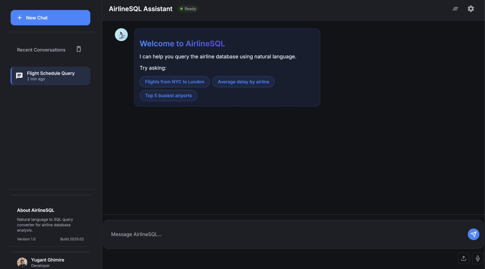
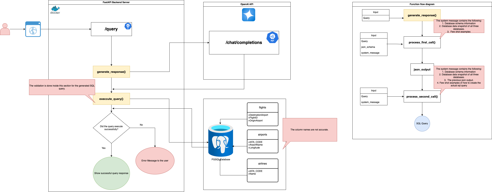

# AirlineSQL - Natural Language to SQL Query Assistant

A FastAPI-based web application that converts natural language questions into SQL queries for airline database analysis, powered by OpenAI's GPT-4o-mini.

## User Interface


## System Architecture


## Features

- 🗣️ Natural language to SQL conversion
- 🚀 Real-time streaming responses
- 📊 Interactive query results
- 🎨 Modern, responsive UI
- 🔄 Asynchronous processing
- 🔍 Step-by-step query explanation

## Tech Stack

### Backend
- **FastAPI** - Modern async web framework
- **PostgreSQL** - Database engine
- **OpenAI** - Natural language processing
- **Tenacity** - Retry mechanism

### Frontend
- **HTMX** - Dynamic UI updates


## Architecture
- **app/**
  - **api/**
    - **routes/** - API endpoints
  - **config/** - Configuration settings
  - **core/** - Core functionality
  - **models/** - Data models
  - **services/** - Business logic
  - **static/** - Static assets
  - **templates/** - Jinja2 templates
  - **utils/** - Utility functions
- **main** - Main script that runs the project.


## Setup

1. Clone the repository:
```bash
git clone https://github.com/yourusername/text2sql.git
cd text2sql
```
2. Create .env file:
```txt
OPENAI_API_KEY=your_api_key_here
DB_NAME=airlinedb
DB_USER=postgres
DB_PASSWORD=password
DB_HOST=localhost
DB_PORT=5432
```

3. run locally:
```bash
python -m venv venv
source venv/bin/activate
pip install -r requirements.txt
python main.py
```


## Author
Yugant Ghimire
