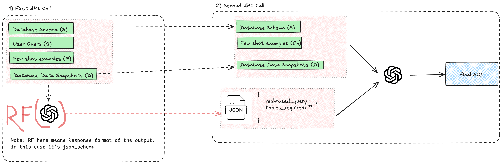

# AirlineSQL - Natural Language to SQL Query Assistant

A FastAPI-based web application that converts natural language questions into SQL queries for airline database analysis, powered by OpenAI's GPT-4o-mini.

## User Interface


## System Architecture


## Algorithm for SQL Generation  

This approach follows a two-step SQL generation technique, loosely inspired by the [RSL-SQL paper](https://arxiv.org/abs/2411.00073).  

However, several enhancements have been made to adapt it to this context, leveraging the latest techniques, such as OpenAI’s `response_format` (also supported by other LLMs).  

### Steps in the Algorithm  

1. **System Prompt Building**  
   - Constructs the system prompt for both the first and second API calls.  
   - The structure follows the diagram below.  

2. **Response Formatting**  
   - Ensures structured output to guide the second API call in the right direction.  
   - Includes:  
     - A rephrased query considering the background information.  
     - A list of required tables for generating the SQL query.  

3. **Second API Call (SQL Generation)**  
   - Uses the JSON output from the first call as the user query input.  
   - Includes additional context:  
     - Database schema  
     - Database snapshots (to ensure consistency)  

4. **SQL Query Validation**  
   - Rule-based validation via string manipulation and regex.  
   - **Only** `SELECT` statements are allowed; others raise an issue.  
   - All queries are limited to `LIMIT 10` to prevent excessive data exposure in the UI.  

  


## Features

- 🗣️ Natural language to SQL conversion
- 🚀 Real-time streaming responses
- 📊 Interactive query results
- 🎨 Modern, responsive UI
- 🔄 Asynchronous processing
- 🔍 Step-by-step query explanation

## Tech Stack

### Backend
- **FastAPI** - Modern async web framework
- **PostgreSQL** - Database engine
- **OpenAI** - Natural language processing
- **Tenacity** - Retry mechanism

### Frontend
- **HTMX** - Dynamic UI updates


## Architecture
- **app/**
  - **api/**
    - **routes/** - API endpoints
  - **config/** - Configuration settings
  - **core/** - Core functionality
  - **models/** - Data models
  - **services/** - Business logic
  - **static/** - Static assets
  - **templates/** - Jinja2 templates
  - **utils/** - Utility functions
- **main** - Main script that runs the project.


## Setup

1. Clone the repository:
```bash
git clone https://github.com/yourusername/text2sql.git
cd text2sql
```
2. Create .env file:
```txt
OPENAI_API_KEY=your_api_key_here
DB_NAME=airlinedb
DB_USER=postgres
DB_PASSWORD=password
DB_HOST=localhost
DB_PORT=5432
```

3. run locally:
```bash
python -m venv venv
source venv/bin/activate
pip install -r requirements.txt
python main.py
```


## Author
Yugant Ghimire
